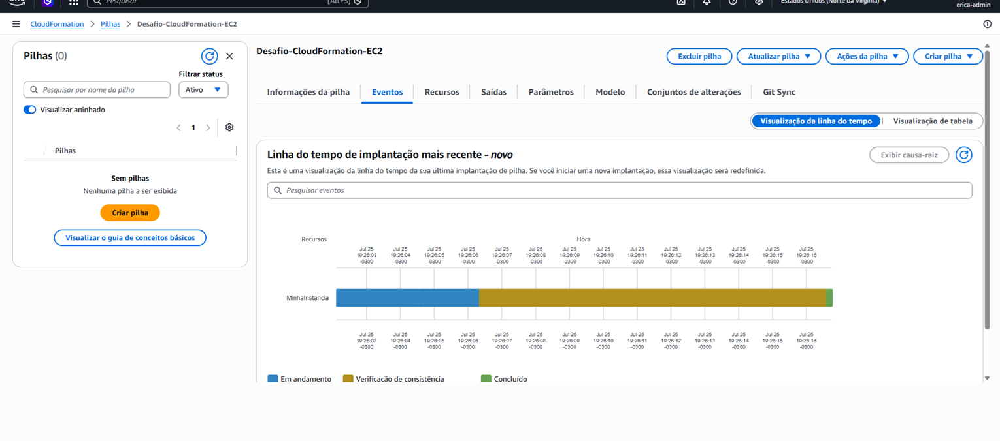

# AWS CloudFormation

 **Bootcamp:** Desafio de Projeto — DIO (Digital Innovation One)  
 **Tecnologias Utilizadas:** AWS CloudFormation, Amazon EC2, IaC (Infraestrutura como Código), YAML, Git e GitHub  

---

O **AWS CloudFormation** é um serviço da Amazon Web Services que permite criar, gerenciar e atualizar recursos de infraestrutura na nuvem de forma declarativa e automatizada, utilizando o conceito de **Infraestrutura como Código (IaC - Infrastructure as Code)**.

Através dele, em vez de criar servidores, bancos de dados, redes e permissões manualmente clicando no console da AWS, descrevemos toda a arquitetura desejada em um arquivo de texto formatado em **YAML** ou **JSON** (chamado de *Template*). 

O CloudFormation lê esse template, calcula as dependências entre os recursos e provisiona tudo de forma consistente em um agrupamento chamado **Stack (Pilha)**.

---

##  Vantagens de Utilizar Templates IaC

Adotar o AWS CloudFormation e a Infraestrutura como Código traz diversos benefícios operacionais e de engenharia de software:

1. **Automação e Reprodutibilidade:** Ambientes inteiros (Desenvolvimento, Homologação, Produção) podem ser clonados e recriados em minutos apenas executando o mesmo template.
2. **Redução de Erros Manuais:** Elimina falhas humanas causadas por esquecimentos de configurações ou cliques incorretos no console web.
3. **Versionamento de Infraestrutura:** Por ser um arquivo de texto (`.yaml` ou `.json`), o template pode ser armazenado em repositórios Git, permitindo histórico de alterações, revisões de código (*Pull Requests*) e facilidade para identificar quem alterou o quê.
4. **Gerenciamento Unificado de Ciclo de Vida:** Todos os recursos pertencentes a uma stack são criados, atualizados ou excluídos juntos. Ao deletar a stack, o CloudFormation garante a remoção de todos os componentes associados, evitando recursos órfãos.
5. **Garantia de Estado e Rollback Automático:** Se algum recurso falhar durante a criação da stack, o CloudFormation desfaz todas as alterações automaticamente (*rollback*), retornando a conta ao estado estável anterior.

---

##  Desafios Encontrados e Soluções

Durante a execução prática do laboratório, foram enfrentados problemas reais de provisionamento, cuja resolução trouxe aprendizados valiosos:

### 1. Falha por AMI (Amazon Machine Image) Expirada ou Inexistente
* **Problema:** Ao utilizar um dos códigos de exemplo com o ID de imagem fixo (`ami-0ed9277fb7eb570c9`), a criação da stack falhava com o status `CREATE_FAILED`. Isso ocorreu porque os IDs de AMIs mudam constantemente com atualizações de segurança da AWS e variam conforme a região geográfica.
* **Solução:** Substituímos o ID estático da AMI por uma referência dinâmica ao **AWS Systems Manager (SSM) Parameter Store** (`/aws/service/ami-amazon-linux-latest/al2023-ami-kernel-default-x86_64`). Dessa forma, a stack busca sempre a imagem oficial mais recente do Amazon Linux 2023 de forma automática.

### 2. Incompatibilidade do Tipo de Instância com o Free Tier (`t2.micro` vs `t3.micro`)
* **Problema:** A stack retornava o erro:  
  `The specified instance type is not eligible for Free Tier...`  
  Isso aconteceu porque em contas recentes ou em determinadas Zonas de Disponibilidade, o tipo de instância `t2.micro` deixou de ser o padrão do Nível Gratuito (Free Tier), sendo substituído por hardware de nova geração (`t3.micro`).
* **Solução:** O atributo `InstanceType` de `t2.micro` foi alterado para **`t3.micro`** e foi removido a amarração rígida da `AvailabilityZone: us-east-1a`, permitindo que a AWS selecione a subnet com capacidade disponível para a camada gratuita.

---

##  Template Utilizado

Abaixo está o template YAML final utilizado para o provisionamento da instância EC2:

```yaml
AWSTemplateFormatVersion: '2010-09-09'
Description: Criar um Amazon EC2 simples - Desafio DIO

Parameters:
  LatestAmiId:
    Type: 'AWS::SSM::Parameter::Value<AWS::EC2::Image::Id>'
    Default: '/aws/service/ami-amazon-linux-latest/al2023-ami-kernel-default-x86_64'
    Description: Busca o ID da AMI do Amazon Linux 2023 mais recente via SSM.

Resources:
  MinhaInstancia:
    Type: 'AWS::EC2::Instance'
    Properties:
      ImageId: !Ref LatestAmiId
      InstanceType: t3.micro
      Tags:
        - Key: Name
          Value: EC2

```





