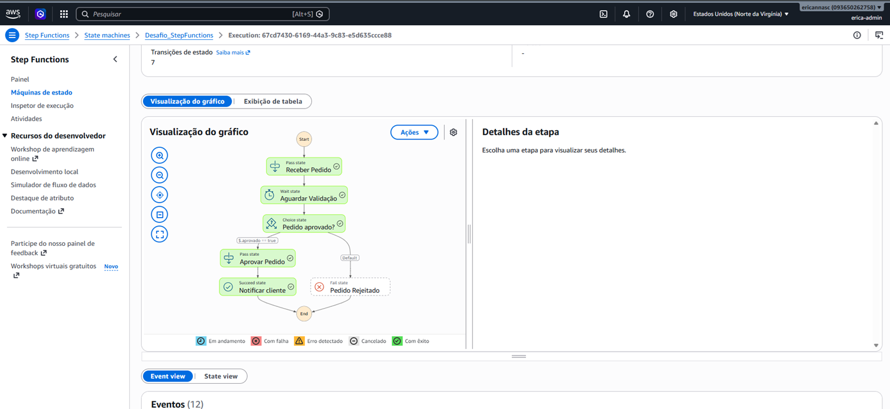
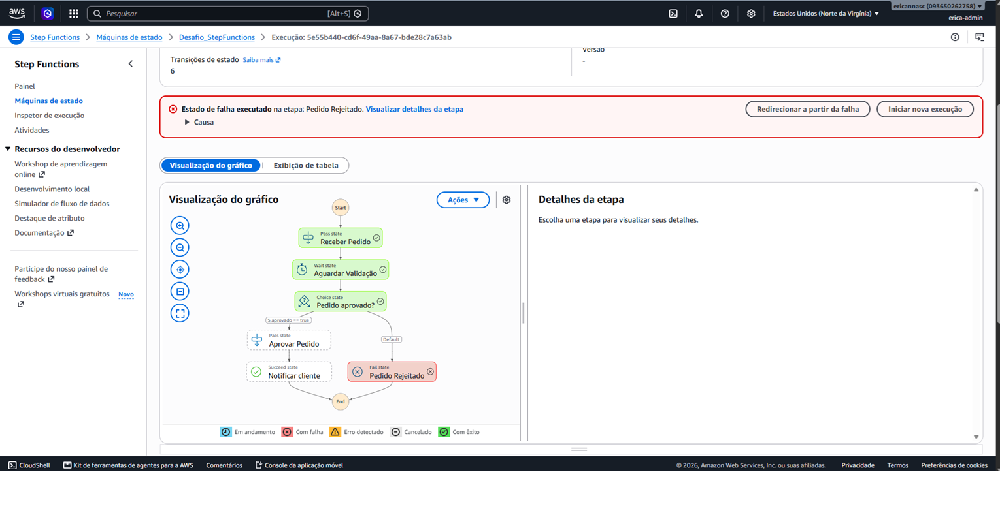
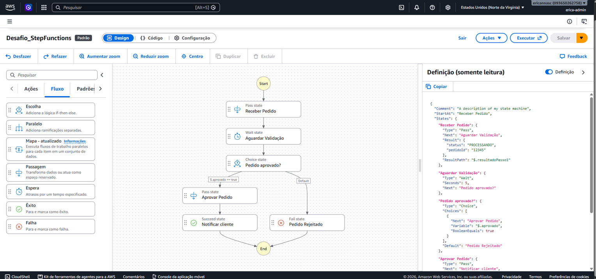
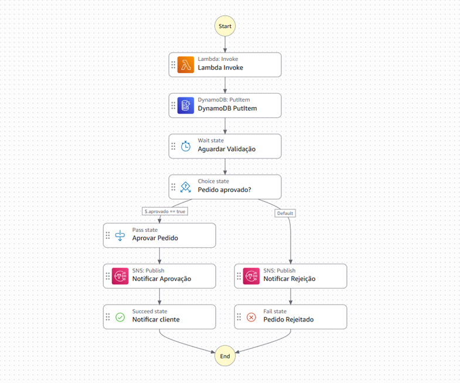

# Workflows na AWS com Step Functions

Este arquivo contém a documentação e a implementação prática de uma máquina de estado criada no **AWS Step Functions**, desenvolvida como entrega do desafio prático na plataforma **DIO**.

---

## 📌 O que é o AWS Step Functions?

O **AWS Step Functions** é um serviço de orquestração serverless que permite coordenar múltiplos serviços da AWS e componentes de aplicação em workflows visuais e estruturados. 

Ele gerencia automaticamente o estado da aplicação, a execução das etapas, a passagem de dados entre blocos, retentativas em caso de falhas e o tratamento de erros, permitindo que desenvolvedores criem arquiteturas resilientes e de fácil manutenção.

---

## 💡 Benefícios de Utilizar o Step Functions

* **Visualização Clara e Em Tempo Real:** Permite desenhar e monitorar o fluxo de execução graficamente através do Workflow Studio.
* **Gerenciamento de Estado Automático:** Elimina a necessidade de manter estados intermediários em código manual ou bancos de dados adicionais.
* **Resiliência e Tratamento de Erros:** Suporte nativo a *Retry* (tentativas) e *Catch* (tratamento de exceções), além de estados dedicados a sucesso (`Succeed`) e falha (`Fail`).
* **Integração Serverless Direta:** Conecta-se nativamente a mais de 220 serviços da AWS (como Lambda, DynamoDB, SQS, SNS, EventBridge) sem a necessidade de código *boilerplate*.
* **Economia e Escala:** Pague apenas pelas transições de estado executadas, escalando automaticamente de acordo com a demanda.

---

## 📐 Ideia do Fluxo Desenvolvido

O fluxo construído simula o **ciclo de vida do processamento de um pedido**, avaliando a aprovação ou rejeição da transação com base na entrada fornecida.

```text
       ┌────────────────────┐
       │ Receber Pedido     │ (Pass)
       └─────────┬──────────┘
                 │
                 ▼
       ┌────────────────────┐
       │ Aguardar Validação │ (Wait - 5s)
       └─────────┬──────────┘
                 │
                 ▼
       ┌────────────────────┐
       │ Pedido Aprovado?   │ (Choice)
       └──────┬───────┬─────┘
        Sim   │       │ Não
              ▼       ▼
┌──────────────┐   ┌────────────────┐
│Aprovar Pedido│   │Pedido Rejeitado│ (Fail)
└──────┬───────┘   └────────────────┘
       │
       ▼
┌──────────────┐
│  Finalizado  │ (Succeed)
└──────────────┘

```

## Etapas do Fluxo:

1. **Receber Pedido (Pass):** Simula a entrada do payload com os dados do pedido (pedidoId e status: PROCESSANDO).
2. **Aguardar Validação (Wait):** Pausa a execução por 5 segundos simulando o tempo de processamento ou integração externa.
3. **Pedido Aprovado? (Choice):** Avalia a variável $.aprovado:
    - Se **true** $\rightarrow$ segue a Rule #1 rumo à aprovação.
    - Se **false** ou ausente $\rightarrow$ segue o caminho Default para rejeição.
4. **Aprovar Pedido (Pass) e Pedido Finalizado (Succeed):** Atualiza o status para APROVADO e conclui a execução com sucesso.
5. **Pedido Rejeitado (Fail):** Encerra a execução sinalizando a falha com código PedidoNaoAprovado.





---

## Desafios e Soluções Encontradas

Durante o desenvolvimento da primeira versão prática no Workflow Studio, surgiram dúvidas técnicas fundamentais que ajudaram a aprofundar o conhecimento no serviço:

### 1. Representação do "Sim" e "Não" no nó Choice
- **Dúvida:** Como configurar os caminhos de aprovação ("Sim") e rejeição ("Não") se o Step Functions não possui rótulos diretos com esses nomes no código?
- **Solução:** Compreendeu-se que o "Sim" é mapeado pela Rule #1 (uma condição booleana que avalia se $.aprovado == true), enquanto o "Não" é representado pela rota Default, que captura qualquer condição contrária ou falha na regra principal.

### 2. JSONata vs. JSONPath (Padrão Tradicional)
- **Dúvida:** Ao iniciar a construção, o console configurou o projeto no formato moderno JSONata, gerando dúvidas sobre como mudar para o padrão tradicional JSONPath.
- **Solução:** Foi realizada a alteração da linguagem de consulta (Query Language) nas configurações gerais da State Machine para JSONPath, restaurando a sintaxe clássica com seletores iniciados por $..

### 3. Sobrescrita de Variáveis entre Estados (ResultPath)
- **Desafio:** Ao testar a primeira execução enviando {"aprovado": true}, o nó Choice falhou com o erro Invalid path '$.aprovado'.
- **Causa:** O nó inicial Receber Pedido (Pass) estava sobrescrevendo todo o payload de entrada pelo seu objeto de resultado (Result), apagando a variável $.aprovado antes de chegar no nó de decisão.
- **Solução:** Configurou-se a propriedade ResultPath como $.infoPedido no nó Receber Pedido. Isso instruiu o Step Functions a preservar o JSON de entrada original e apenas anexar o resultado do nó sob a nova chave infoPedido.

---

## A Linguagem por Trás da Interface (ASL)

Embora a máquina de estado tenha sido construída utilizando o construtor visual (Workflow Studio), toda a interface drag-and-drop é traduzida em tempo real para o Amazon States Language (ASL) — uma especificação baseada em JSON que define estados, transições, saídas e regras.



---

## Recursos e Serviços AWS Utilizados

Para evoluir o fluxo de uma simples simulação para uma **arquitetura Serverless real e resiliente**, foram integrados diversos serviços nativos da AWS. Cada componente desempenha um papel específico no processamento, persistência e comunicação do ciclo de vida do pedido:


---

### 1.  AWS Lambda (`Lambda: Invoke`)
* **Tipo de Estado:** `Task`
* **Função no Fluxo:** Atua como o ponto de entrada da lógica de negócio. A função recebe o payload inicial contendo os dados do pedido, realiza as validações necessárias (ex: regra de negócio, verificação de consistência) e retorna um objeto contendo o status da avaliação e a flag `aprovado` (`true`/`false`).

### 2.  Amazon DynamoDB (`DynamoDB: PutItem`)
* **Tipo de Estado:** `Task`
* **Função no Fluxo:** Responsável pela **persistência NoSQL de alta performance**. O estado utiliza a integração direta via SDK (*PutItem*) para gravar os dados do pedido na tabela `Pedidos` assim que ele é processado, registrando o estado inicial como `PROCESSANDO`. 
* *Nota Técnica:* O parâmetro `ResultPath` foi configurado como `$.dynamoResult` para preservar as variáveis do payload de entrada (como `aprovado`) para as etapas seguintes.

### 3.  Amazon SNS (`SNS: Publish`)
* **Tipo de Estado:** `Task`
* **Função no Fluxo:** Serviço de mensageria pub/sub para **notificação em tempo real**. Foram utilizados dois nós distintos de publicação:
  * **Notificação de Aprovação:** Dispara uma mensagem via tópico SNS informando ao cliente/equipe que o pedido foi aprovado e processado.
  * **Notificação de Rejeição:** Envia um alerta informando que o pedido não atendeu aos critérios de validação.

