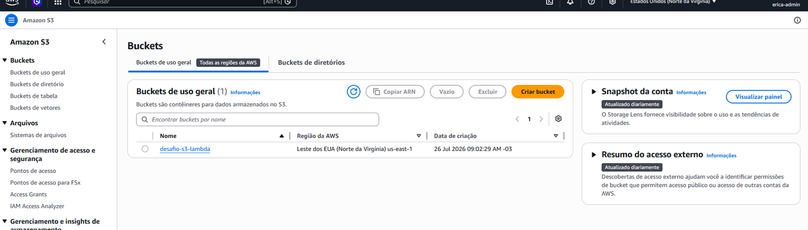
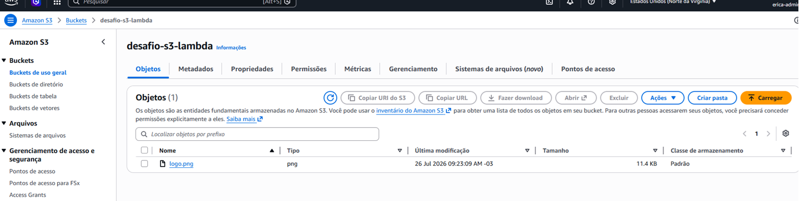
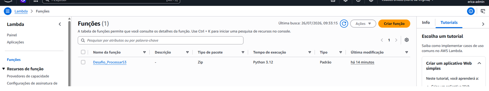
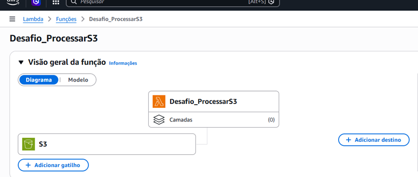
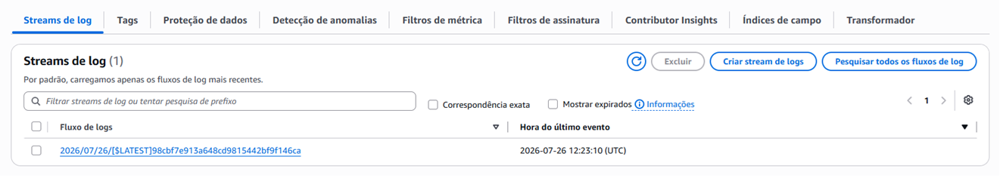
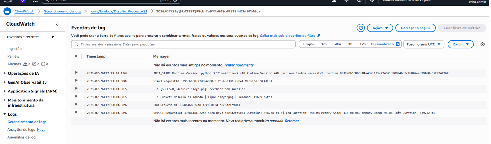

# Automação de Tarefas com AWS Lambda e Amazon S3

Projeto prático desenvolvido para consolidar conhecimentos em arquitetura **Serverless** na AWS. O objetivo foi criar uma automação em que o envio de um arquivo para um bucket no **Amazon S3** aciona automaticamente uma função **AWS Lambda**, processando os metadados do arquivo em tempo real e gerando logs no **Amazon CloudWatch**.

---

##  Visão geral e arquitetura

O fluxo da automação funciona da seguinte forma:

1. **Upload do Arquivo**: Um arquivo é enviado ao bucket Amazon S3.
2. **Disparo de Evento**: O S3 identifica o evento `s3:ObjectCreated:*` e aciona a função AWS Lambda.
3. **Processamento Serverless**: A função Lambda é executada, recupera informações sobre o arquivo (nome, tipo, tamanho) e executa a lógica necessária.
4. **Auditoria e Logs**: Toda a execução e os dados do processamento são gravados no Amazon CloudWatch Logs.

---

##  Por que usar AWS Lambda com gatilhos (Triggers)?

A combinação de armazenamento (S3) com computação baseada em eventos (Lambda) traz diversas vantagens competitivas:

* **Arquitetura 100% Event-Driven**: O código só roda quando algo realmente acontece. Não há necessidade de servidores ligados 24/7 "esperando" por novos arquivos.
* **Redução Drástica de Custos**: Com a cobrança por milissegundo de execução, paga-se apenas pelo tempo real de processamento do arquivo.
* **Escalabilidade Automática**: Se 1 ou 10.000 arquivos forem enviados simultaneamente, a AWS escala instâncias da Lambda automaticamente para processar cada um deles em paralelo.
* **Baixa Manutenção Operacional**: Ausência de gerenciamento de infraestrutura, atualizações de SO ou provisionamento de servidores.

---

##  Casos de uso no mercado

Essa padrão de arquitetura (S3 + Lambda) é amplamente utilizado em empresas para soluções reais como:

* **Processamento de Mídia**: Redimensionamento automático de imagens (ex: criar thumbnails de fotos de perfil logo após o upload) ou conversão de formatos de vídeo.
* **Pipelines de Dados (ETL)**: Leitura de arquivos `.csv` ou `.json` enviados por parceiros/sistemas para ingestão e carga automática em bancos de dados (DynamoDB, RDS, Redshift).
* **Validação e Compliance**: Inspeção automática de documentos enviados por usuários para verificar extensão, presença de vírus ou integridade do conteúdo.
* **Geração de Documentos**: Criação automática de relatórios em PDF ou recibos a partir do envio de dados brutos de transações.

---

##  Projeto

### Recursos criados

* **Bucket S3**: `desafio-s3-lambda` (Armazenamento dos arquivos)
  



* **Função AWS Lambda**: `Desafio_ProcessarS3` (Lógica de processamento em Python)
  



* **IAM Role**: `Role-Lambda-S3-DIO` (Gerenciamento de permissões com as políticas `AWSLambdaBasicExecutionRole` e `AmazonS3ReadOnlyAccess`)


* **CloudWatch:** Registro criado pela execução do lambda ao receber o gatilho de novo arquivo adicionado ao bucket S3.





### Código da função Lambda

A função foi escrita em **Python 3.12** utilizando a biblioteca **Boto3** (SDK da AWS) para interceptar os metadados do arquivo recebido:

```python
import json
import urllib.parse
import boto3

s3 = boto3.client('s3')

def lambda_handler(event, context):
    # Captura o nome do bucket e o nome do arquivo enviado a partir do evento do S3
    bucket = event['Records'][0]['s3']['bucket']['name']
    key = urllib.parse.unquote_plus(event['Records'][0]['s3']['object']['key'], encoding='utf-8')
    
    try:
        # Busca os metadados do objeto no Amazon S3
        response = s3.get_object(Bucket=bucket, Key=key)
        file_type = response['ContentType']
        file_size = response['ContentLength']
        
        print(f"--> [SUCESSO] Arquivo '{key}' recebido com sucesso!")
        print(f"--> Bucket: {bucket} | Tipo: {file_type} | Tamanho: {file_size} bytes")
        
        return {
            'statusCode': 200,
            'body': json.dumps(f'Arquivo {key} processado com sucesso!')
        }
    except Exception as e:
        print(f"--> [ERRO] Falha ao processar {key} do bucket {bucket}: {str(e)}")
        raise e
```

## Para validar o fluxo:

Foi realizado o upload de um arquivo de imagem (logo) para o bucket desafio-s3-lambda.

A Lambda Desafio_ProcessarS3 foi acionada instantaneamente.

Através do Amazon CloudWatch, foi possível confirmar nos logs a leitura correta do nome do arquivo, seu tipo (image/png ou image/jpeg) e o tamanho em bytes.
