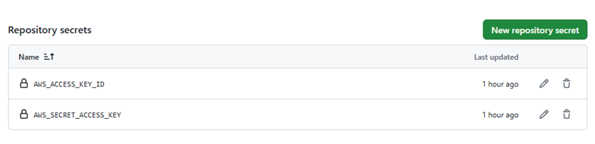
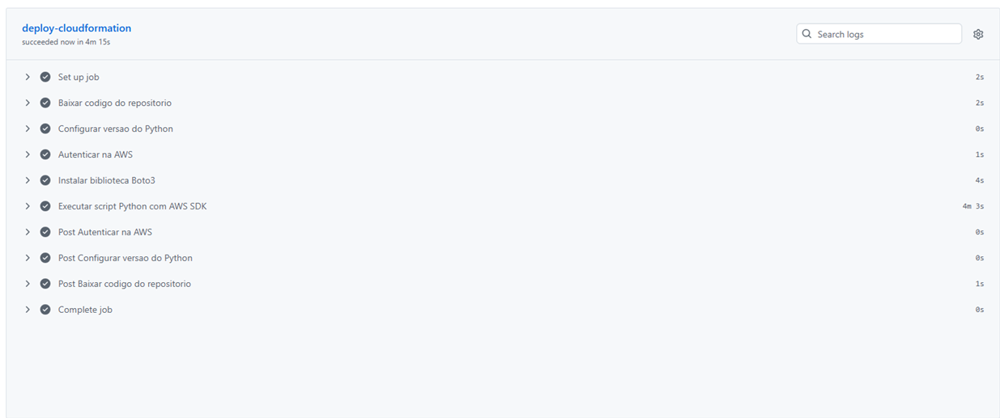
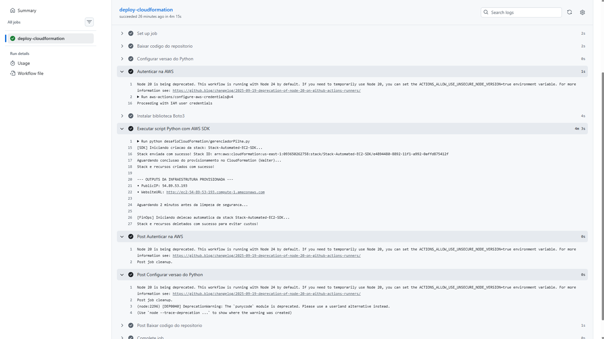
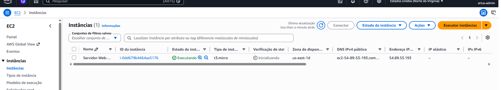
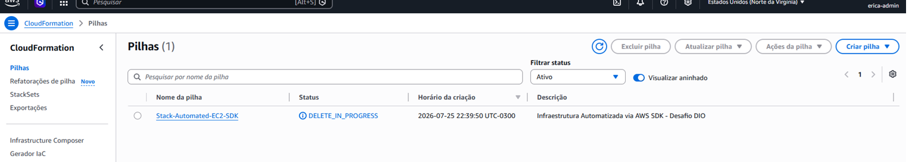

# Automação de Infraestrutura na AWS com CloudFormation, Python SDK e GitHub Actions

Este projeto apresenta uma solução automatizada de Infraestrutura como Código (IaC) e Continuous Integration/Continuous Deployment (CI/CD) para o provisionamento e desprovisionamento de recursos na AWS.

---

- **Automação de Infraestrutura:** Substitui o gerenciamento manual pelo console da AWS por rotinas programadas. Garante repetibilidade, elimina erros manuais e traz agilidade ao ambiente.

- **AWS SDK (Software Development Kit):** O boto3 é o SDK oficial da AWS para Python. Ele permite interagir diretamente com as APIs da AWS para criar, consultar e deletar recursos programaticamente.

- **YAML:** É uma linguagem de serialização de dados legível por humanos. No CloudFormation, o arquivo .yaml serve como um "blueprint" (planta baixa) que descreve exatamente os recursos que a AWS deve subir.

- **Pipeline (CI/CD):** Uma esteira de execução automatizada no GitHub Actions (.github/workflows/deploy.yml) que responde a eventos de código (como um git push), preparando o ambiente, autenticando na AWS e executando os scripts sem intervenção humana.

---

## Desafios Encontrados e Soluções

Durante a estruturação e execução da solução, foram superados os seguintes pontos críticos:

**Autenticação Segura (Gestão de Credenciais):**
- **Desafio:** Não expor chaves de acesso no código público.
- **Solução:** Utilização do GitHub Secrets (AWS_ACCESS_KEY_ID e AWS_SECRET_ACCESS_KEY) em conjunto com a ação aws-actions/configure-aws-credentials no runner do GitHub.



---

## Passo a Passo da Execução

**1. Configuração de IAM e Secrets (Passo 1).**
Criação de um usuário IAM com permissões adequadas na AWS e adição do AWS_ACCESS_KEY_ID e AWS_SECRET_ACCESS_KEY no painel de Settings > Secrets and variables > Actions do repositório no GitHub.

**2. Estruturação dos Arquivos:**
Organização dos arquivos do projeto na pasta desafioCloudFormation/ para o template e script Python, e .github/workflows/ para o arquivo da esteira.

**3. Publicação do Código:**
Envio das alterações via git push origin main, disparando a execução automática da pipeline.



**4. Validação e Ciclo FinOps:**
Acompanhamento dos logs na aba Actions do GitHub: o servidor é provisionado, o IP/URL público é exibido nos logs, o sistema aguarda 2 minutos e executa a exclusão da stack para zerar custos.



**5. Criação automatizada no CloudFormation:**
Após execução no GitHub Actions, a nova instância foi criada e entrou em execução na AWS. Passado os minutos para deleção, ela foi excluída.







---

## Códigos do Projeto

desafioCloudFormation/infraestrutura.yaml

``` 
AWSTemplateFormatVersion: '2010-09-09'
Description: 'Infraestrutura Automatizada via AWS SDK - Desafio DIO'

Parameters:
  InstanceTypeParam:
    Type: String
    Default: t3.micro
    AllowedValues:
      - t3.micro
      - t2.micro
    Description: Tipo de instancia elegivel para o Free Tier

  LatestAmiId:
    Type: 'AWS::SSM::Parameter::Value<AWS::EC2::Image::Id>'
    Default: '/aws/service/ami-amazon-linux-latest/al2023-ami-kernel-default-x86_64'
    Description: Busca automatica da AMI mais recente via SSM Parameter Store

Resources:
  WebServerSecurityGroup:
    Type: 'AWS::EC2::SecurityGroup'
    Properties:
      GroupDescription: Permite acesso HTTP (80) e SSH (22)
      SecurityGroupIngress:
        - IpProtocol: tcp
          FromPort: 80
          ToPort: 80
          CidrIp: 0.0.0.0/0
          Description: Acesso Web HTTP
        - IpProtocol: tcp
          FromPort: 22
          ToPort: 22
          CidrIp: 0.0.0.0/0
          Description: Acesso SSH de Administracao
      Tags:
        - Key: Name
          Value: web-server-sg

  MyWebServerInstance:
    Type: 'AWS::EC2::Instance'
    Properties:
      InstanceType: !Ref InstanceTypeParam
      ImageId: !Ref LatestAmiId
      SecurityGroupIds:
        - !Ref WebServerSecurityGroup
      UserData:
        Fn::Base64: !Sub |
          #!/bin/bash
          dnf update -y
          dnf install -y httpd
          systemctl start httpd
          systemctl enable httpd
          echo "<h1>Infraestrutura Automatizada via GitHub Actions e AWS SDK!</h1>" > /var/www/html/index.html
      Tags:
        - Key: Name
          Value: Servidor-Web-Automated-SDK
        - Key: Environment
          Value: Dev

Outputs:
  PublicIP:
    Description: IP Publico do Servidor Web
    Value: !GetAtt MyWebServerInstance.PublicIp

  WebsiteURL:
    Description: URL do Servidor Web
    Value: !Sub 'http://${MyWebServerInstance.PublicDnsName}'
```

desafioCloudFormation/gerenciadorPilha.py

```
import boto3
import sys
import time

REGION = "us-east-1"
STACK_NAME = "Stack-Automated-EC2-SDK"
TEMPLATE_PATH = "desafioCloudFormation/infraestrutura.yaml"

cf_client = boto3.client("cloudformation", region_name=REGION)


def load_template(path):
    with open(path, "r", encoding="utf-8") as file:
        return file.read()


def create_stack():
    print(f"[SDK] Iniciando criacao da stack: {STACK_NAME}...")
    template_body = load_template(TEMPLATE_PATH)

    response = cf_client.create_stack(
        StackName=STACK_NAME,
        TemplateBody=template_body,
    )
    print(f"Stack enviada com sucesso! Stack ID: {response['StackId']}")

    print("Aguardando conclusao do provisionamento no CloudFormation (Waiter)...")
    waiter = cf_client.get_waiter("stack_create_complete")
    waiter.wait(StackName=STACK_NAME)
    print("Stack e recursos criados com sucesso!")


def get_stack_outputs():
    response = cf_client.describe_stacks(StackName=STACK_NAME)
    outputs = response["Stacks"][0].get("Outputs", [])

    print("\n--- OUTPUTS DA INFRAESTRUTURA PROVISIONADA ---")
    for output in outputs:
        print(f"• {output['OutputKey']}: {output['OutputValue']}")


def delete_stack():
    print(f"\n[FinOps] Iniciando delecao automatica da stack {STACK_NAME}...")
    cf_client.delete_stack(StackName=STACK_NAME)

    waiter = cf_client.get_waiter("stack_delete_complete")
    waiter.wait(StackName=STACK_NAME)
    print("Stack e recursos deletados com sucesso para evitar custos!")


if __name__ == "__main__":
    try:
        # 1. Provisiona a infraestrutura
        create_stack()
        
        # 2. Exibe os dados gerados (IP / URL)
        get_stack_outputs()
        
        # Pausa de 2 minutos para permite visualização/testes nos logs
        print("\nAguardando 2 minutos antes da limpeza de seguranca...")
        time.sleep(120)
        
        # 3. Limpeza FinOps
        delete_stack()

    except Exception as e:
        print(f"Erro na execucao da automacao: {e}", file=sys.stderr)
        sys.exit(1)
```

.github/workflows/deploy.yml

```
name: Deploy Automatizado via AWS SDK

on:
  push:
    branches: [ "main" ]
  workflow_dispatch:

jobs:
  deploy-cloudformation:
    runs-on: ubuntu-latest

    steps:
      - name: Baixar codigo do repositorio
        uses: actions/checkout@v4

      - name: Configurar versao do Python
        uses: actions/setup-python@v5
        with:
          python-version: '3.11'

      - name: Autenticar na AWS
        uses: aws-actions/configure-aws-credentials@v4
        with:
          aws-access-key-id: ${{ secrets.AWS_ACCESS_KEY_ID }}
          aws-secret-access-key: ${{ secrets.AWS_SECRET_ACCESS_KEY }}
          aws-region: us-east-1

      - name: Instalar biblioteca Boto3
        run: |
          python -m pip install --upgrade pip
          pip install boto3

      - name: Executar script Python com AWS SDK
        run: python desafioCloudFormation/gerenciadorPilha.py
```

